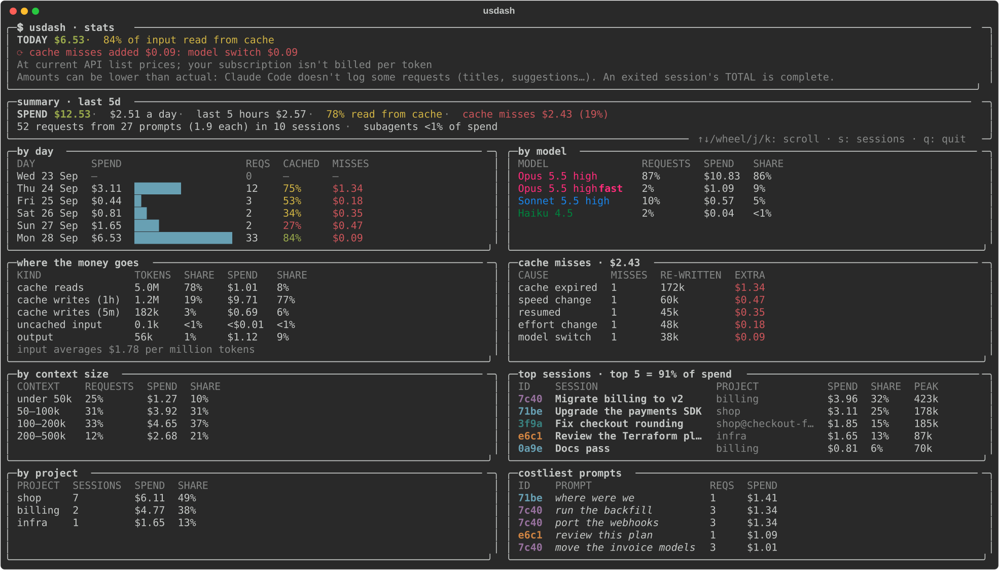

# 💲 usdash

[](https://github.com/pdudotdev/usdash/releases)
[](LICENSE)
[](https://github.com/pdudotdev/usdash/commits/master/)

A live terminal dashboard for **your own Claude Code costs**. It reads the transcripts Claude Code already writes on your machine and shows, for each session, whether its prompt cache is still warm, what the session has cost, and what your next message will cost. Press `s` for where the money went: by day, model, kind of token, cache miss, context size, session, project and prompt.

Every amount is measured: the tokens each request logged, at Anthropic's list prices, or, once a session exits, Claude Code's own total for it. The one exception is labelled `up to`, and it's an upper bound.

It reads Claude Code's files, plus Anthropic's public pricing page once at start. The only file it writes is its copy of that page. Nothing is routed through it, nothing about you or your sessions leaves your machine, and it changes nothing in Claude Code.

▫️ **Why the prompt cache matters:**
- [x] **While it's warm**, each message reads the conversation back at a tenth of the input price, or less
- [x] **It expires** at least 5 minutes or 1 hour after the last request started, and each request restarts that clock
- [x] **After a miss**, the whole conversation is written again, at 1.25× to 2× the input price


## 📖 **Table of Contents**
- 💲 **usdash**
  - [🔭 Overview](#-overview)
  - [📊 Stats](#-stats)
  - [🔀 How It Works](#-how-it-works)
  - [🧪 Example Session](#-example-session)
  - [🚀 Installation & Usage](#-installation--usage)
  - [⚠️ Limitations](#️-limitations)
  - [💡 Concepts 101](#-concepts-101)
  - [📂 Project Files](#-project-files)
  - [⬆️ Planned Upgrades](#️-planned-upgrades)
  - [📄 Disclaimer](#-disclaimer)
  - [📜 License](#-license)
  - [📧 Hi](#-hi)

## 🔭 Overview

usdash is a small Python program you keep open in a terminal next to your Claude Code sessions. At the top: today's spend. Below it, every session from the last 5 days: the ones you're in, with what the next message costs, and the ones you've left, with what coming back to them costs at most. `s` swaps in the [stats](#-stats).

▫️ **What it looks like** (made-up sessions, drawn by usdash's own screen code):


▫️ **The header,** top to bottom:

| Line | What it says |
|---|---|
| **TODAY** | Today's spend at list prices, and the share of all input read back from the cache (to a tenth of a percent from 99%, so it never rounds up to 100%): green from 90%, yellow from 30%, red below (the same in Stats) |
| **⟳ cache misses added** | In red, only on a day with misses: what the requests that had to write the conversation again, instead of reading it back, cost beyond reading it. By cause, the biggest first; a cause that added under half a cent is left out here. [Stats](#-stats) has them all, over the last 30 days |
| **Prices** | Which prices the dollars are: Anthropic's current API list prices, or, if the pricing page can't be read at start, the last ones read, with their date. On a subscription it adds that your plan isn't billed per token. Warnings follow in yellow: requests with no known price (left out of the totals), a pricing page that no longer reads as expected, record types usdash doesn't know, and Desktop sessions deleted in the last 30 days, whose cost is gone ([Limitations](#️-limitations)) |
| **Caveat** | Amounts can be lower than actual: Claude Code doesn't log some of its requests, but an exited session's TOTAL is complete ([Limitations](#️-limitations)) |

▫️ **Each session, and how to tell which window it is:**

| Shown | What it is |
|---|---|
| **ID** | The first 4 characters of the session id (as in `/status`), in a fixed colour per session. `claude --resume` doesn't take them: it takes the whole id, or a name to search for |
| **SESSION** | Your `/rename`, else the Desktop app's sidebar title, else the agent's name, else Claude Code's automatic title, else the first thing you typed (a command that runs a prompt, like a skill or `/init`, counts; a built-in like `/model` only if it's all there is) |
| **PROJECT** | The project folder, plus `@branch` unless it's main, master or a detached HEAD. `no folder` for a Desktop session started without one (WHERE says `Desktop`) |
| **WHERE** | Where it runs: `CLI` (a terminal, including an IDE's built-in one), `IDE` (the VS Code extension's panel, also in forks like Cursor), `Desktop` (the Desktop app's Code tab) or `script` (`claude -p`, the SDKs). Any other app shows as Claude Code names it; `?` if the transcript doesn't say |
| **MODEL** | The model and effort of the last request, and `fast` in fast mode |
| **CACHE** | `● mm:ss`: the prompt cache is warm, and runs out in that long. Green, then **yellow** for its last 10 minutes (the last half of a 5-minute cache)<br>`○ expired · idle 2h`: it has run out, in a session that's still open, unused for 2 hours. `○ expired · working` while Claude Code is still busy there (a tool or subagent running, or its answer to their results on its way); `○ expired · subagent` while it waits for a subagent working in the background<br>`exited · ● mm:ss`: you quit it (`/exit` or closing the window), and its cache outlasts it<br>`exited · idle 3h`: you quit it, and its cache has run out<br>`archived · idle 3h` (or `archived · ● mm:ss`): you archived it in the Desktop app, which also closes it<br>Once the cache has run out, the next message re-writes the whole conversation |
| **CONTEXT** | The conversation's size: everything the next message sends again (the tool list, the system prompt and every message so far), as the last request sent it. `compacted` right after `/compact`, until the next message measures the new size |
| **TODAY** · **TOTAL** | What the session has cost today (`—` if nothing), and since it started (a resumed session counts its earlier days too, and every subagent it ran). Once you've quit it, TOTAL is Claude Code's own figure, which also counts the requests its transcripts never log; after a resume, that figure plus what the transcripts show since. A figure below what the transcripts show is an incomplete record, and TOTAL stays theirs |

▫️ **Three panes**, in the order you'd come back to them, with the columns lined up across all three: **live** (the cache is still warm), **expired** (its cache ran out, but it wasn't exited: type in its window if it's still open, else `claude --resume` and pick it; a session killed or crashed without exiting shows here too) and **exited** (you quit it, or archived it in the Desktop app: `claude --resume` and pick it). A pane with no session in it isn't shown. A folder's finished script runs (`claude -p`, SDKs) fold into one row in the exited pane, so a loop of them doesn't bury your sessions.

▫️ **What coming back costs.** A live session shows what you last typed there, and every session shows what its next message re-sends and what that costs:

```
├ 23m ago · "run the suite and tell me what fails"
└ next message re-sends 182k tokens: $0.04 now · up to $1.46 once the cache expires
```

| Where | The line |
|---|---|
| Live | `next message re-sends 182k tokens: $0.04 now · up to $1.46 once the cache expires` |
| Exited, cache still warm | `resuming re-sends 182k tokens: $0.04 now · up to $1.46 once the cache expires` |
| Expired, still open | `continuing re-sends 420k tokens: up to $3.36` |
| Exited, cache run out | `resuming re-sends 420k tokens: up to $3.36` |
| Right after `/compact` | `compacted: the next message measures the new size` |

The gap between the two amounts is, at most, what letting the cache expire costs; while the countdown is yellow, so is the `up to` amount. Every amount is at the session's own model, speed and region.

▫️ **Measured or `up to`:**
- **now** is the conversation read back from the cache: its size as the last request sent it, at the cache-read price. It's exact: in real sessions on Claude Code 2.1.278–2.1.283, 1,938 of 1,939 next messages within the cache lifetime read the whole previous prompt back, to 100 tokens (the other changed effort on a model where that re-writes it), and the [real-session tests](tests/test_real_checks.py) hold usdash to it. Resuming an exited session reads it back the same way while the cache lasts
- **up to** is the conversation written to the cache again, at the write price. It's an upper bound: Claude Code's tool list at the start of every request (22–25k tokens in the CLI) often stays cached anyway, kept warm by another session in the same folder or by Claude Code's own unlogged requests. On Opus 5.5 with a 1-hour cache, that's about $0.18 less
- What your next message adds (your text, tool results, the reply) isn't known yet, so it's left out of both

▫️ **Key characteristics:**
- [x] **Read-only and local:** besides the transcripts, it reads two fields of your account record (subscription or not), and the Desktop app's session titles and deleted-session markers
- [x] **Every surface on the machine:** terminal, VS Code extension, Desktop app Code tab, scripts
- [x] **Subscription or API key:** the cache lifetime of each session is read from its own usage data (1 hour or 5 minutes). On a subscription, the dollars are what the same requests would cost on the API: a like-for-like measure of your usage, not your bill
- [x] **Numbers, not advice:** what each session has cost, what its next message costs now, and what it will cost at most once the cache expires
- [x] **Cache misses explained:** each request that had to write the conversation again is counted, with its likely cause, in the header and in Stats
- [x] **Checked against Claude Code's own numbers:** tested on real (redacted) transcripts; see [Limitations](#️-limitations) for how close the totals are

## 📊 Stats

Press `s` for where the money went over the last 30 days, and `s` again to go back. It counts every logged request with a known price that ended in that period, main conversation and subagents alike. While sessions are at work, it's worked out again every few seconds.

Under the summary, the panels come in pairs, in the order you'd ask: **when, and on what** (by day, where the money goes), **what set the price** (by model, by context size), **where it went** (by project, top sessions), and **what to act on** (cache misses, costliest prompts).



| Panel | What it shows |
|---|---|
| **Summary** | SPEND, and per day over the days the transcripts cover (`since` the day they begin, if that's after the period does; none for a day or less); the last 5 hours (for a period longer than that); the share of input read from the cache; what cache misses added, and their share of SPEND. Then requests, the prompts they answer (what you typed: a prompt, a command like a skill that sends requests, or a message typed while Claude Code was still at work) and requests per prompt (how many API calls each thing you asked took), sessions, the subagents' share of SPEND, and how much of Claude Code's own totals the transcripts hold, in the sessions that exited ([Limitations](#️-limitations)) |
| **By day** | The last 5 local days, today included: SPEND with a bar, requests, the share read from cache (green from 90%, yellow from 30%, red below) and what cache misses added. The rest of the period is one `earlier` row above them, with no bar (it sums many days), and none at all if nothing was spent then |
| **Where the money goes** | Tokens and dollars by kind: cache reads, cache writes (1-hour and 5-minute), uncached input, output (a kind with no tokens is left out). Volume isn't cost: reads are most of the tokens and little of the money. Underneath, what input costs on average per million tokens: reads, writes and uncached input together. A web searches row appears if any logged request made server-side searches |
| **By model** | Each model at each effort, and fast mode, as a row of its own: its share of requests against its share of SPEND. A model and effort with 20% of the requests and 70% of the spend is the first place to look for savings |
| **By context size** | Requests grouped by how big their conversation was: under 50k, 50–100k, 100–200k, 200–500k, 500k and more. Late turns in a long conversation cost more each; this shows how much of SPEND they are |
| **By project** | SPEND by project folder (branches together), the top 5, then the rest as `others`. Two folders with the same name show with as much of their path as tells them apart: `work/api`, `personal/api` |
| **Top sessions** | The 5 that cost the most in the period, their share of SPEND together and each, and PEAK, the largest conversation each sent |
| **Cache misses** | By cause (`cache expired`, `model switch`, `resumed`, `effort change`, `speed change` for fast mode turned on, `Claude Code upgraded`, `cause unknown`): how many, the tokens written again, and what that cost beyond reading them back. `no cache misses` in green when there were none |
| **Costliest prompts** | The 5 things you typed that cost the most in the period: everything a prompt or slash command set off (its tool calls, and its subagents for as long as they run) until you typed the next one |

Every panel that splits SPEND (by day, by kind, by model, by context size, by project) adds up to it exactly, and the cache-miss panel to the summary's total; the tests hold them to that. With more rows than fit, the panels scroll a row at a time with the same keys as the sessions. From 144 columns wide, each pair sits side by side; narrower, one panel a row, in the same order.

## 🔀 How It Works

▫️ **Where the data comes from:**
- [x] Claude Code writes every session to `~/.claude/projects/<folder>/<session-id>.jsonl`, and each subagent to `<session-id>/subagents/agent-<id>.jsonl`, one JSON line per record
- [x] Each reply carries its model, effort and token usage: uncached input, cache reads, cache writes (5-minute or 1-hour) and output, and any server-side web searches
- [x] At start, usdash reads the last 30 days a session at a time, keeping only the fields it uses: about 3 seconds and 120 MB of memory for 300 MB of transcripts, where it was tested
- [x] Then it reads new lines about once a second, looks for new sessions and subagents every 5 seconds, and redraws at most twice a second

▫️ **Every reply:**
1. Several records of one streamed reply are merged into one request, keyed by `message.id` (not `requestId`, which some sessions don't record)
2. The request's start is the time of the record it answers: your prompt or a tool result, or what Claude Code attached to them just before sending, whichever came last. The cache clock counts from there
3. Its cost is its tokens at Anthropic's list prices, from the [pricing page](https://platform.claude.com/docs/en/about-claude/pricing) (see below). Fast mode (2× on Opus 5.5) and US-only inference (1.1× on Claude 4.6 and later) are priced as the page says, from each reply's usage, and each web search adds the page's per-search price ($10 per 1,000). Web fetches cost only their tokens
4. It's compared with the conversation's previous request. If it failed to read back at least 30% of what it could have, not counting the tool list the session measured (and 5,000 tokens or more, counted in its own model's tokens after a switch), it's a **cache miss**, with the likely cause: a model switch, the cache expired, a Claude Code upgrade (it applies when Claude Code starts, so it comes with a resume), a resume, fast mode turned on, or an effort change; else `cause unknown`. Right after `/compact`, only the tool list could be read back: the summary is new, so writing it isn't a miss
5. The session's cache clock, what re-sending it costs, and the stats are updated

▫️ **What it knows about the models, and where from:**

| Fact | Where from |
|---|---|
| **Prices**: tokens, fast mode, web search | Read at start from the [pricing page](https://platform.claude.com/docs/en/about-claude/pricing); else its last copy; else [`usdash/pricing.yaml`](usdash/pricing.yaml), shipped with usdash |
| **Where an effort change keeps the cache**: Opus 5.5, Sonnet 5.5 and Fable 5.1 | [`usdash/models.yaml`](usdash/models.yaml): what Claude Code does, from [its docs](https://code.claude.com/docs/en/prompt-caching), and checked in transcripts on Opus 5.5. The API docs list Opus 5 too, where Claude Code re-wrote. It only names a miss's cause |
| **Tokenizers**: every model before Claude Opus 4.7 counts the same text as about 0.77× the tokens | `usdash/models.yaml`. It only compares two requests across a model switch, to tell a miss |

The page is fetched as plain Markdown, within 4 seconds, and read strictly: a page that doesn't read as expected (other columns, prices out of line with each other) is refused, the header says in yellow that it changed, and its last copy is used. A page that isn't Anthropic's at all (a Wi-Fi sign-in page) counts as not reached. The last copy is kept in `~/.cache/usdash/docs.json` (under `$XDG_CACHE_HOME` if that's set), and a copy older than what ships with usdash is ignored. A brand-new model is priced from the page with no usdash release. A request with no known price (a model the prices don't list, or fast mode on a model whose fast prices aren't listed) is left out of the totals, and the header says so in yellow, rather than priced wrong.

> ⚠️ **NOTE:** The transcript format is internal to Claude Code and can change with any release. usdash reads it leniently (missing fields are "unknown", not a crash) and counts record types it doesn't know. If the header reports unknown records after a Claude Code update, check usdash with the [manual sanity suite](tests/sanity/manual.py).

## 🧪 Example Session

| # | What you do | What usdash shows |
|---|---|---|
| 1 | Start `claude` in `shop` on branch `checkout-fix` and ask a question | A new live session: your first words as its name, `shop@checkout-fix`, `● 59:5x` on a subscription (`● 4:5x` on an API key) |
| 2 | Wait for Claude Code to title the session | The name changes to that title |
| 3 | `/rename checkout bug` | The name becomes `checkout bug` |
| 4 | Keep working on Opus 5.5 | `next message re-sends …k tokens: $… now · up to $… once the cache expires` |
| 5 | `/model sonnet`, then send a message | The header's `⟳ cache misses added $…: model switch $…` appears; Stats (`s`) counts it under **cache misses** |
| 6 | Step away until the countdown turns yellow | The last 10 minutes of the cache (2½ of a 5-minute one): the `up to` amount turns yellow too |
| 7 | Stay away until it runs out | The session moves to the expired pane, `○ expired · idle 1h`, with `continuing re-sends …k tokens: up to $…` |
| 8 | `/compact`, then send a message | CONTEXT says `compacted` until that message measures the new size |
| 9 | `/exit` | `exited · ● mm:ss` (the cache outlives the session), TOTAL becomes Claude Code's own figure (usually higher: it counts requests the transcripts miss), and what resuming costs |
| 10 | Press `s` | The session in **top sessions**, your prompts in **costliest prompts**, the day's bar in **by day** |

## 🚀 Installation & Usage

▫️ **Step 1 - Install it on the machine where Claude Code runs** (macOS or Linux):
```
curl -LsSf https://raw.githubusercontent.com/pdudotdev/usdash/master/install.sh | sh
```

[`install.sh`](install.sh) installs [uv](https://docs.astral.sh/uv/) if it's missing, then usdash with it: in an environment of its own, with a Python 3.11+ that uv fetches if the machine has none (Ubuntu 22.04 has 3.10), and `usdash` in `~/.local/bin`. It needs no git. Run it again to update usdash.

Or install it yourself, with [uv](https://docs.astral.sh/uv/getting-started/installation/) or with [pipx](https://pipx.pypa.io/) where Python 3.11+ is already there (macOS with Homebrew, Ubuntu 24.04):
```
uv tool install git+https://github.com/pdudotdev/usdash
pipx install git+https://github.com/pdudotdev/usdash
```

If a new terminal then says `command not found`, `~/.local/bin` isn't on your PATH yet: run `uv tool update-shell` (or `pipx ensurepath`) once and open a new terminal.

▫️ **Step 2 - Run it next to your sessions:**
```
usdash                    # sessions of the last 5 days, stats of the last 30, then live
```

▫️ **Or from a clone,** to change it (running the tests: [Project Files](#-project-files)). Python 3.11+ is needed, and `usdash` works while the virtual environment is active:
```
git clone https://github.com/pdudotdev/usdash
cd usdash
python3 -m venv .venv
source .venv/bin/activate
pip install -e .
```

| Option | Meaning |
|---|---|
| `--once` | Print one screen and exit |
| `--version` | Print the version and exit |

It reads the transcripts in `$CLAUDE_CONFIG_DIR/projects` if that's set, else `~/.claude/projects`. The sessions cover the last 5 days, the stats the last 30.

↑/↓, the mouse wheel or `j`/`k` scroll a session (in Stats, a row of panels) at a time; `space`/`b` move a page, `g`/`G` jump to the top or the bottom. When they don't all fit, the header's title says which sessions show (`sessions 1–16 of 55`: the panes' counts added up), and the Stats summary's title which rows of panels (`rows 1–3 of 4`). `s` swaps the sessions and the stats, each keeping its place. `q` quits.

> ⚠️ **NOTE:** usdash shows the sessions **of the machine it runs on**: it reads Claude Code's transcripts there, and Claude Code writes them where it runs. When you work on a remote machine over SSH, that's the remote machine, so install and run usdash there:
> - **VS Code, or a fork like Cursor, with Remote-SSH:** the Claude Code extension runs on the server. Run usdash in the editor's built-in terminal
> - **The Desktop app's SSH connections:** Desktop [installs Claude Code on the remote machine and runs it there](https://code.claude.com/docs/en/desktop). Run usdash in an SSH terminal to it. The session's sidebar title and archive state stay in the app on your computer, so there usdash shows Claude Code's own title, and doesn't mark an archived session as archived
>
> A container adds nothing: it would need your `~/.claude` mounted, and can't reach another machine's.

## ⚠️ Limitations

▫️ **Where it works:**

| You use Claude Code in… | Covered? |
|---|---|
| A terminal, the VS Code extension, the Desktop app's Code tab, scripts (`claude -p`) | Yes |
| VS Code Remote-SSH, the Desktop app's SSH connections, or a terminal on a server | Yes, with usdash running on that server |
| claude.ai/code and other cloud sessions | No: their transcripts aren't on your machine |
| Amazon Bedrock, Google Cloud | Partly: see below |
| Windows | Not natively (usdash reads keys through the Unix terminal); use WSL |

▫️ **Sessions with transcript saving off don't appear:**
Claude Code then shows `⚠ Transcript saving is off — inherited CLAUDE_CODE_CHILD_SESSION` in the session. That happens in a terminal started from inside a Claude Code session (e.g. a terminal app launched by one): it inherits that variable, and every `claude` started from it saves no transcript. Quit the terminal app and open it again from the Dock or launcher.

▫️ **Amounts read low until a session exits:**
Claude Code makes requests its transcripts never log:

| Request | What's known about it |
|---|---|
| Session titles | Small, on Haiku 4.5 |
| Prompt suggestions | Mostly cache reads |
| The recap written while you're away | Re-reads the conversation on the session's model, about 3 minutes after the last reply if you've switched away from the window, and restarts the cache clock. Claude Code 2.1.288 writes it only while the cache is warm; older versions could write an expired cache again |
| `/compact`'s summarising request | Reads what's cached, the rest at the input price; its output is the summary (1–4k tokens) |
| WebSearch's searches | A request of their own, plus $10 per 1,000 searches: four searches were 72% of one `claude -p` session's cost |
| Background summaries for `--resume` | Not measured |
| `/btw` side questions | Not in the transcript at all |
| The Desktop app's own requests | On the session's model |

On the machine usdash was built on, the transcripts held 41–100% of what Claude Code counted (a median of 89%), least in very short sessions and in ones that ran many subagents. Weighted by cost, 84%, and 23% on Haiku 4.5, which Claude Code uses for requests of its own.

When you quit a session, Claude Code writes its own total, which counts them all: TOTAL shows it from then on. A total below the transcripts' is incomplete (a Desktop session reopened days later wrote $0.00 for $0.90 of requests), and TOTAL stays theirs. TODAY and the stats stay the transcripts' figures: Claude Code's total isn't split by day or by request. For a budget, divide SPEND by the Stats summary's `transcripts hold N%` to estimate the full amount at list prices.

▫️ **Deleting a Desktop session deletes its cost:**
Archiving a session in the Desktop app keeps its transcript and Claude Code's total. Deleting it removes both and leaves only a marker with no costs (`<id>.desktop-released.json`): what the session cost drops out of TODAY, TOTAL and the stats, and the header counts, in yellow, the sessions deleted in the last 30 days. A usdash already running keeps showing a deleted session until you restart it. Archive the sessions you want counted.

▫️ **Past requests are priced at today's list prices:**
usdash reads the prices at start and prices every request with them, whenever it ran. After Anthropic changes a price, earlier days are priced anew too, and can differ from what was billed then.

▫️ **The stats reach back only as far as the transcripts do:**
Claude Code deletes a session's transcript 30 days after its last activity by default ([`cleanupPeriodDays`](https://code.claude.com/docs/en/data-usage), in its settings; Desktop sessions are kept). The stats cover the same 30 days; with a lower `cleanupPeriodDays`, they reach back only that far. When the transcripts begin after the period does, the Stats average a day covers only the days they do, and says since when.

▫️ **Code execution:** without web search or web fetch in the same request, it's billed per container-hour against a free monthly allowance per organisation, so one session's share can't be known. It isn't counted; with them, it's free.

▫️ **Amazon Bedrock and Google Cloud:**
Sessions appear, their cache lifetime and costs are read the same way, and Bedrock model ids like `us.anthropic.claude-opus-5-5` are recognised. But:
- Prices are Anthropic's list prices, which match the **global** endpoints (`global.`). Claude Code's default Bedrock ids use geographic prefixes (`us.`, `eu.`, `apac.`) in most regions, and those cost **10% more**. The same 10% applies to Google Cloud's regional and multi-region endpoints
- Application inference profile ARNs aren't mapped to a model, so those requests have no cost; the header counts them
- Not yet checked with a real Bedrock or Google Cloud transcript: whether Claude Code records the provider's model id or the plain model name. If it's the plain name, a cache miss after an effort change there would show as `cause unknown` instead of `effort change`

▫️ **The cache lifetime is a minimum:**
Anthropic deletes a cache "promptly, though not immediately" once its lifetime is up: in real sessions, one 5-minute cache was read back half a minute after that, and two others were gone at 5¾ and 10½ minutes. So a session may still read its cache back a little after the countdown ends: one more reason coming back is priced `up to`.

▫️ **A resumed session can miss the cache:**
Resuming within the cache lifetime read it all back in 8 of 10 real resumes (one a minute after `/exit` with a file written in between, one on a 5-minute cache); the other two read back only the tool list. A resumed conversation keeps the system prompt it started with. It can still miss when something else at the start of the request changed with the restart: tools an MCP server or plugin loads up front, the system prompt flags given to the resume, or a Claude Code upgrade that changed them (shown as `Claude Code upgraded`; two upgrades measured here didn't). The `now` amount assumes nothing did.

▫️ **Some causes are invisible:**
Some changes that break the cache leave no trace in the transcripts, so a miss they cause shows up as `cause unknown`: tools that change mid-session (an MCP server or plugin that loads its tools up front, a deny rule for a whole tool when tool search is off), the oldest images that Claude Code drops once a request passes the image limit, and a gateway or proxy that strips the cache markers or changes the model behind Claude Code's back.

▫️ **Cost isn't the only goal:** a stronger model can finish in fewer messages. The dollars are there to decide with.

## 💡 Concepts 101

▫️ **Prompt caching**

Every message re-sends the whole conversation. Anthropic caches the start of each request, so the unchanged part is read back cheaply and only the new part costs full price:

| Request | Contents | From cache | New |
|---|---|---|---|
| Turn 1 | tools + system + **msg 1** | nothing | everything |
| Turn 2 | … + msg 1 + reply 1 + **msg 2** | up to msg 1 | reply 1 + msg 2 |
| Turn 3 | … + msg 2 + reply 2 + **msg 3** | up to msg 2 | reply 2 + msg 3 |

- **Price:** a cache read costs 0.1× the input price (0.05× on Opus 5.5, 0.025× on Fable 5.1). A cache write costs 1.25× (5-minute cache) or 2× (1-hour cache)
- **Per model:** each model has its own cache, so a model switch writes the whole conversation again. Opus 5.5 and Sonnet 5.5 even read the cache at the same price, so moving a cached conversation from Opus to Sonnet saves almost nothing on its cached part
- **Reset by:** a model switch; an effort change (except on Opus 5.5, Sonnet 5.5 and Fable 5.1 with an API key or subscription); turning fast mode on (in Claude Code, only the first time in a conversation); `/compact`; a Claude Code upgrade that changes the tool list or system prompt (not all do). The tool list at the start often survives

▫️ **Cache lifetime**

| | Subscription (within plan usage) | API key, usage credits, cloud provider |
|---|---|---|
| Main conversation | 1 hour | 5 minutes |
| Subagents and compaction | 5 minutes | 5 minutes |

`promptCacheTtl` (or `CLAUDE_CODE_PROMPT_CACHE_TTL`) changes the main conversation's lifetime; usdash reads the lifetime each session really uses from its usage data. It's a minimum, but don't count on more ([Limitations](#️-limitations)). The clock restarts at the **start** of every request that uses the cache:
- A long skill run stays warm, since each tool step is a new request, unless a single step or tool runs longer than the lifetime
- A subagent refreshes its own cache, not the parent's: a parent waiting on a long subagent can go cold
- Either way, a session whose cache runs out while Claude Code is still busy there moves to the expired pane as `○ expired · working`: its next request will write the conversation again. usdash tells busy from the transcript: a reply that called a tool (a subagent is one) whose result isn't back yet, or results not yet answered. After 30 minutes without a new record, its subagents' included, it no longer counts as busy (the session was likely stopped mid-tool)
- A subagent started in the background is different: the parent ends its turn and waits to be told the subagent is done. While that subagent keeps writing records after the parent's last reply, the parent shows `○ expired · subagent` (with the same 30-minute bound)
- When Claude Code writes its recap of the session (about 3 minutes after its last reply, once you've switched away from the window), it re-reads the conversation: the clock restarts, and usdash's countdown jumps back up. Claude Code 2.1.288 skips the recap once 90% of the lifetime has passed; on older versions one could come after the cache ran out, write the conversation again, and bring the session back to the live pane

▫️ **Switching model mid-conversation**

The other model has to write the whole conversation into its own cache, while staying reads it back. Example (from a real run): moving a warm 56k-token conversation from Opus 5.5 to Sonnet 5 cost $0.143; staying on Opus cost about $0.02. A cheaper model saves on every later message, so a switch can pay for itself over a long session, if that model is good enough for the task; after a break long enough for the cache to expire, it costs nothing extra.

▫️ **The full picture**

The field guide behind these numbers (what LLM usage costs and why, prompt caching, and the evidence from real sessions) now lives in a private knowledge base, `pdudotdev/llm-kb`.

## 📂 Project Files

| File | Role |
|---|---|
| [`usdash/`](usdash/) | The dashboard: transcript reader, pricing-page reader, sessions, cost engine, stats, screen |
| [`usdash/stats.py`](usdash/stats.py) | The Stats view's figures: sums over the period's requests, no rendering |
| [`usdash/pricing.yaml`](usdash/pricing.yaml) | Anthropic's list prices as shipped, with the date they were verified: used when the pricing page can't be read and no copy of it is saved |
| [`usdash/models.yaml`](usdash/models.yaml) | What usdash knows about the models besides their prices: where an effort change keeps the cache, and the tokenizers |
| [`install.sh`](install.sh) | The one-line installer: uv if it's missing, then usdash ([`tests/test_install.py`](tests/test_install.py) runs it against stand-ins for curl and uv) |
| [`scripts/make_fixture.py`](scripts/make_fixture.py) | Copies a real transcript into the test fixtures with its text removed |
| [`scripts/readme_screen.py`](scripts/readme_screen.py) | Draws the README's pictures of the dashboard, [`docs/dashboard.svg`](docs/dashboard.svg) and [`docs/stats.svg`](docs/stats.svg), from made-up sessions |
| [`docs/`](docs/) | The README's pictures: the sessions, the stats and how usdash works |
| [`tests/`](tests/) | Automated tests on synthetic transcripts and redacted real ones; [`tests/test_real_checks.py`](tests/test_real_checks.py) holds usdash's numbers to what real sessions sent and what Claude Code charged, and [`tests/test_stats.py`](tests/test_stats.py) holds every Stats figure to sums worked out by hand. Plus the manual sanity suite, [`tests/sanity/manual.py`](tests/sanity/manual.py) |
| [`.github/workflows/tests.yml`](.github/workflows/tests.yml) | Runs the automated tests on every push and pull request, on macOS and Ubuntu, Python 3.11 and 3.12, in UTC and in UTC+9, and installs usdash with `install.sh` on both |

Run the tests with `pip install -r requirements-dev.txt && pytest -q`, and print the manual suite with `python3 tests/sanity/manual.py`.

## ⬆️ Planned Upgrades
- [x] Live cache countdown, and what the next message costs now and at most
- [x] A session-first screen: the last 5 days, what coming back to each session costs
- [x] Prices read from Anthropic's pricing page at start, with a saved copy to fall back on
- [x] Stats: where the money went, by day, model, kind, cause, context size, session, project and prompt
- [x] A one-line install on macOS and Linux
- [ ] Bedrock and Google Cloud prices: the 10% regional premium, and inference-profile ARNs mapped to their model
- [ ] An opt-in Claude Code hook (`PreModelSwitch`) that shows usdash's numbers before a switch

## 📄 Disclaimer
usdash shows amounts at list prices. Your real bill comes from Anthropic, your cloud provider, or your plan. It isn't an official Anthropic tool.

## 📜 License
Licensed under the [**GNU General Public License v3.0**](LICENSE).

## 📧 Hi
Wanna say hello? DM me on [**LinkedIn**](https://www.linkedin.com/in/tmihaicatalin/).
