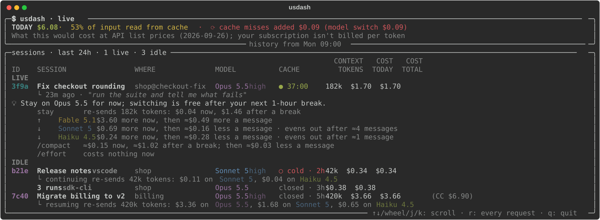

# 💲 usdash

[](https://github.com/pdudotdev/usdash/releases)
[](LICENSE)
[](https://github.com/pdudotdev/usdash/commits/master/)

A live terminal dashboard for **your own Claude Code costs**. It reads the transcripts Claude Code already writes on your machine and shows, for each session, whether its prompt cache is still warm, what the session has cost, and what your next message will cost on each model.

It reads Claude Code's files, plus two pages of Anthropic's public docs once at start: the prices and the current models (`--offline` skips even that). The only file it writes is its copy of those pages. Nothing is routed through it, nothing about you or your sessions leaves your machine, and it changes nothing in Claude Code.

▫️ **Why the prompt cache matters:**
- [x] **While it's warm**, each message reads the conversation back at a tenth of the input price, or less
- [x] **It expires** 5 minutes or 1 hour after the last request started, and each request restarts that clock
- [x] **After a miss**, the whole conversation is written again, at 1.25× to 2× the input price


## 📖 **Table of Contents**
- 💲 **usdash**
  - [🔭 Overview](#-overview)
  - [🔀 How It Works](#-how-it-works)
  - [🧪 Example Session](#-example-session)
  - [🚀 Installation & Usage](#-installation--usage)
  - [⚠️ Limitations](#️-limitations)
  - [💡 Concepts 101](#-concepts-101)
  - [📂 Project Files](#-project-files)
  - [⬆️ Planned Upgrades](#️-planned-upgrades)
  - [📄 Disclaimer](#-disclaimer)
  - [📜 License](#-license)
  - [📧 Hi](#-hi)

## 🔭 Overview

usdash is a small Python program you keep open in a terminal next to your Claude Code sessions. At the top: today's spend. Below it, every session from the last 24 hours: the ones you're in, with what the next message costs on each model, and the idle ones, with what coming back to them costs. Press `r` for the list of every request.

▫️ **What it looks like** (made-up sessions, drawn by usdash's own screen code):



▫️ **The header:** today's spend at list prices, the share of all input that was read back from the cache, and what cache misses added today, by cause: requests that had to send the conversation again at full price instead of reading it back (the `⟳` rows in the request list). The second line says what the dollars are: Anthropic's current API list prices (if the pricing page can't be read at start, the last prices read from it, with their date), and on a subscription account what the same use would cost on an API key. Any warnings follow it, in yellow: requests with no known price (left out of the totals), a page of Anthropic's docs that no longer reads as expected, and record types usdash doesn't know. The third line says why amounts can be lower than actual: Claude Code doesn't log some of its requests, but an exited session's TOTAL is complete ([Limitations](#️-limitations)).

▫️ **Each session, and how to tell which window it is:**

| Shown | What it is |
|---|---|
| **ID** | The first 4 characters of the session id (as in `/status` and `claude --resume`), in a fixed colour per session |
| **SESSION** | Your `/rename`, else the Desktop app's sidebar title, else the agent's name, else Claude Code's automatic title, else the first thing you typed |
| **PROJECT** | The project folder, plus `@branch` unless it's main, master or a detached HEAD. `Desktop (no folder)` for a Desktop session without one |
| **WHERE** | Where it runs: `CLI` (a terminal), `IDE` (the VS Code extension), `Desktop` (the Desktop app's Code tab) or `script` (`claude -p`, the SDKs); `?` if the transcript doesn't say |
| **MODEL** | The model and effort of the last request, and `fast` in fast mode |
| **CACHE** | `● mm:ss` while the prompt cache is warm; `○ expired · 2h` once it has run out, in a session that's still open; `exited · 3h` after you quit it (`/exit` or closing the window). The age is how long ago the session was last used. Either way, the next message re-writes the whole conversation |
| **CONTEXT** | The conversation's size: everything the next message sends again (the tool list, the system prompt and every message so far). `≈` right after `/compact`, until the next message shows the new size |
| **TODAY** · **TOTAL** | What the session has cost today (`—` if nothing), and since it started (a resumed session counts its earlier days too, and every subagent it ran). Once you've quit it, TOTAL is Claude Code's own figure, which also counts the requests its transcripts never log; after a resume, that figure plus what the transcripts show since |

▫️ **Live sessions** (the cache is still warm, and you haven't quit) have their own pane at the top, with idle ones in a second pane below; the columns line up across both. Under each live session, what you last typed there and what your next message costs on each model:

```
├ 23m ago · "run the suite and tell me what fails"
└ next message re-sends 182k tokens: $3.64 on Fable 5.1, $0.04 on Opus 5.5 (cached) ✅, $0.73 on Sonnet 5, $0.28 on Haiku 4.5
```

Your own model (in bold) reads the conversation back from its cache; any other model has to write all of it into its own. ✅ marks the cheapest next message: almost always staying where you are. Whether a cheaper model is good enough for the task is your call. In fast mode (MODEL says `fast`), every amount is at fast mode's prices. When a big conversation's cache is about to expire, a warning comes in between (see below).

▫️ **An idle session** (its cache expired, or you quit it) gets one line in the idle pane, with what coming back to it costs on each model:

```
└ resuming re-sends 420k tokens: $8.40 on Fable 5.1, $3.36 on Opus 5.5, $1.68 on Sonnet 5, $0.65 on Haiku 4.5
```

(`continuing` for a session you haven't quit.) A folder's finished script runs (`claude -p`, SDKs) fold into one row, so a loop of them doesn't bury your sessions.

▫️ **Exact or ≈:** an amount without `≈` is exact: the conversation's size as its last request sent it (the transcript records it), at list prices. What your next message adds (your text, tool results, the reply) isn't known yet, so it's left out of those. Amounts with `≈` depend on a size usdash can only estimate: right after `/compact`, or when another session keeps a model's tool list cached; see [Limitations](#️-limitations).

▫️ **Every request** (press `r`), newest first:

| Shown | What it is |
|---|---|
| **TIME** | When the request was sent |
| **ID** · **SESSION** · **MODEL** | Which session sent it, on which model and effort (and `fast` in fast mode) |
| **PROMPT** | Tokens sent: the whole conversation so far |
| **CACHED** | The share of them read back from the cache: green from 80%, yellow from 30%, red below |
| **OUT** · **COST** | Output tokens (thinking included), and the request's cost at list prices (`?` with no known price) |
| **NOTE** | `🤖 subagent` for a subagent's request; `🔍 2 web searches (+$0.02)` for server-side web searches, charged on top of tokens; `⟳ re-wrote 38k: model switch from Opus 5.5 (+$0.09)` when a request had to write the conversation again, with the likely cause and what that cost beyond reading it back |

▫️ **Key characteristics:**
- [x] **Read-only and local:** it reads Claude Code's transcript files and nothing else, except two fields of your account record (subscription or not) and the Desktop app's session titles. Its only requests go to two pages of Anthropic's docs, at start (none with `--offline`), and the only file it writes is its copy of them
- [x] **Every surface on the machine:** terminal, VS Code extension, Desktop app Code tab, scripts
- [x] **Subscription or API key:** the cache lifetime of each session is read from its own usage data (1 hour or 5 minutes)
- [x] **Prices, not advice:** what the next message costs on each model, and what coming back to an idle session costs; the one tip is a warning to `/compact` before a big conversation's cache expires
- [x] **Re-writes explained:** each request that had to write the conversation again is marked, with a likely cause
- [x] **Checked against Claude Code's own numbers:** tested on real (redacted) transcripts; see [Limitations](#️-limitations) for how close the totals are

## 🔀 How It Works

▫️ **Where the data comes from:**
- [x] Claude Code writes every session to `~/.claude/projects/<folder>/<session-id>.jsonl`, and each subagent to `<session-id>/subagents/agent-<id>.jsonl`, one JSON line per record
- [x] Each reply carries its model, effort and token usage: uncached input, cache reads, cache writes (5-minute or 1-hour) and output, and any server-side web searches
- [x] usdash reads new lines about once a second, looks for new sessions and subagents every 5 seconds, and redraws at most twice a second

▫️ **Every reply:**
1. Several records of one streamed reply are merged into one request, keyed by `message.id` (not `requestId`, which some sessions don't record)
2. The request's start is the time of the message it answers: your prompt, or the tool result before it. The cache clock counts from there
3. Its cost is its tokens at Anthropic's list prices, from the [pricing page](https://platform.claude.com/docs/en/about-claude/pricing) (see below). Fast mode (2× on Opus 5.5) and US-only inference (1.1× on Claude 4.6 and later) are priced as the page says, from each reply's usage, and each web search adds the page's per-search price ($10 per 1,000). Web fetches cost only their tokens
4. It's compared with the conversation's previous request. If it failed to read back at least 30% of what it could have (and 5,000 tokens or more), it's a **re-write**, with the likely cause: model switch, cache expired, `/compact`, fast mode turned on or off, Claude Code upgrade, or effort change
5. The session's cache clock and what re-sending it costs on each model are recomputed

▫️ **What it knows about the models, and where from:**

| Fact | Read at start from Anthropic's docs | Else, shipped with usdash |
|---|---|---|
| **Prices**: tokens, fast mode, web search | The [pricing page](https://platform.claude.com/docs/en/about-claude/pricing) | [`usdash/pricing.yaml`](usdash/pricing.yaml) |
| **The current models**, most capable first: the ones every session is priced on | The columns of the [models overview](https://platform.claude.com/docs/en/about-claude/models/overview)'s comparison table | [`usdash/models.yaml`](usdash/models.yaml) |
| **Where an effort change keeps the cache**: Opus 5.5 and Fable 5.1 | n/a: the API docs say what the API can do, not what Claude Code sends (they list Opus 5 too, where Claude Code re-wrote) | `usdash/models.yaml` |
| **Tokenizers**: every model before Claude Opus 4.7 counts the same text as about 0.77× the tokens | n/a (only in prose) | `usdash/models.yaml` |

Each page is fetched as plain Markdown, all at once, within 4 seconds in all, and read strictly: a page that doesn't read as expected (other columns, prices out of line with each other) is refused, the header says in yellow that it changed, and its last copy is used. A page that isn't Anthropic's at all (a Wi-Fi sign-in page) counts as not reached. Each page's last copy is kept in `~/.cache/usdash/docs.json`, and a copy older than what ships with usdash is ignored. A brand-new model is priced and listed from the docs with no usdash release, on the current tokenizer; which models keep the cache across an effort change is updated with usdash. A request with no known price (a model the prices don't list, or fast mode on a model whose fast prices aren't listed) is left out of the totals, and the header says so in yellow, rather than priced wrong.

> ⚠️ **NOTE:** The transcript format is internal to Claude Code and can change with any release. usdash reads it leniently (missing fields are "unknown", not a crash) and counts record types it doesn't know. If the header reports unknown records after a Claude Code update, check usdash with the [manual sanity suite](tests/sanity/manual.py).

▫️ **The one warning** (`⚡`, between your last prompt and the prices): when the conversation is 100k+ tokens, the cache expires within 10 minutes (within half its lifetime, if that's shorter), and compacting saves at least $0.005 a message. *"Taking a break? /compact first: ≈$0.11 now, ≈$0.78 once the cache expires in 5:00."* Compacting while the cache is warm reads the conversation back; after it has expired, it has to write it all again first.

▫️ **When switching model is cheap:** while the cache is warm, another model has to write the whole conversation into its own cache, so the next message costs more there (the prices line shows how much). Once the cache has expired, the next message writes everything again on any model, so switching then costs nothing extra: the idle line shows what each model costs from there. Right after `/compact`, another model can even be cheaper now, if a session in the same folder keeps its copy of the tool list cached; ✅ then moves to it.

## 🧪 Example Session

| # | What you do | What usdash shows |
|---|---|---|
| 1 | Start `claude` in `shop` on branch `checkout-fix` and ask a question | A new live session: your first words as its name, `shop@checkout-fix`, `● 59:5x` on a subscription (`● 4:5x` on an API key) |
| 2 | Wait for Claude Code to title the session | The name changes to that title |
| 3 | `/rename checkout bug` | The name becomes `checkout bug` |
| 4 | Keep working on Opus 5.5 | `next message re-sends …k tokens: … $… on Opus 5.5 (cached) ✅, …`: staying is the cheapest next message |
| 5 | `/model sonnet`, then send a message | Press `r`: a red row `⟳ re-wrote 53k: model switch from Opus 5.5 (+$…)`. The header's `cache misses added` total goes up |
| 6 | Step away until the cache expires | The session moves to the idle pane, `○ expired · 1h`, with a line saying what continuing costs on each model |
| 7 | Come back and keep going until the context is large; then, with 8 minutes of cache left, look again | `⚡` *"Taking a break? /compact first: ≈$… now, ≈$… once the cache expires in 8:00."* |
| 8 | `/exit` | `exited · 1m`, TOTAL becomes Claude Code's own figure (usually a little higher: it counts requests the transcripts miss), and what resuming costs |

## 🚀 Installation & Usage

▫️ **Prerequisites:**

| | macOS | Ubuntu |
|---|---|---|
| Python 3.11+ | `brew install python` | `sudo apt install python3 python3-venv` |
| [Claude Code](https://docs.claude.com/en/docs/claude-code/setup) | ✓ | ✓ |

▫️ **Step 1 - Clone and install:**
```
git clone https://github.com/pdudotdev/usdash
cd usdash
python3 -m venv .venv
source .venv/bin/activate
pip install .
```

▫️ **Step 2 - Run it next to your sessions:**
```
usdash                    # the last 24 hours, then live
```

> ⚠️ **NOTE:** The `usdash` command lives in the virtual environment, so a new terminal says `command not found` until you run `source .venv/bin/activate` in the `usdash` folder. To run it from anywhere, link it onto your PATH once, from that folder: `mkdir -p ~/.local/bin && ln -s "$PWD/.venv/bin/usdash" ~/.local/bin/usdash` (and add `~/.local/bin` to your PATH if it isn't there).

| Option | Meaning | Default |
|---|---|---|
| `--since 2d` | How much history to load first (`m`, `h` or `d`); never less than `--window` | `--window`, or since midnight if that's earlier |
| `--window 8h` | Show sessions active this recently | `24h` |
| `--projects DIR` | Where Claude Code keeps its transcripts | `$CLAUDE_CONFIG_DIR/projects`, else `~/.claude/projects` |
| `--once` | Print one screen and exit | off |
| `--offline` | Don't read Anthropic's docs at start; use their last copies (the header shows the prices' date) | off |

↑/↓, the mouse wheel or `j`/`k` scroll the sessions a session at a time; `space`/`b` move a page, `g`/`G` jump to the top or the bottom. `r` switches to every request and back; there the same keys scroll the list, and while you're scrolled back its rows stay put and the title counts the new ones above them. `q` quits.

> ⚠️ **NOTE:** usdash shows the sessions **of the machine it runs on**. With VS Code Remote-SSH, Claude Code runs on the server, so run usdash in a terminal on that server.

## ⚠️ Limitations

▫️ **Where it works:**

| You use Claude Code in… | Covered? |
|---|---|
| A terminal, the VS Code extension, the Desktop app's Code tab, scripts (`claude -p`) | Yes |
| VS Code Remote-SSH or a terminal on a server | Yes, with usdash running on that server |
| claude.ai/code and other cloud sessions | No: their transcripts aren't on your machine |
| Amazon Bedrock, Google Cloud | Partly: see below |
| Windows | Not tested; use WSL |

▫️ **Amounts read low until a session exits:**
Some requests Claude Code makes never appear in its transcripts: session titles, prompt suggestions, `/compact`'s own summarising request, and others. On the machine usdash was built on, the transcripts held 56–98% of what Claude Code itself counted, 85–95% for most sessions. When you quit a session, Claude Code writes its own total, which counts them all, and from then on TOTAL shows it. TODAY, and the header's TODAY, stay the transcripts' figures: Claude Code's total isn't split by day.

▫️ **Code execution:** without web search or web fetch in the same request, it's billed per container-hour against a free monthly allowance per organisation, so one session's share can't be known. It isn't counted; with them, it's free.

▫️ **Fast mode:** in a fast session, the next message on another model that has fast mode (Opus 5, Opus 4.8) is priced as if it stays fast. Whether Claude Code keeps fast mode across `/model` isn't checked yet (the [manual sanity suite](tests/sanity/manual.py), check 32).

▫️ **Amazon Bedrock and Google Cloud:**
Sessions appear, their cache lifetime and costs are read the same way, and Bedrock model ids like `us.anthropic.claude-opus-5-5` are recognised. But:
- Prices are Anthropic's list prices, which match the **global** endpoints (`global.`). Claude Code's default Bedrock ids use geographic prefixes (`us.`, `eu.`, `apac.`) in most regions, and those cost **10% more**. The same 10% applies to Google Cloud's regional and multi-region endpoints
- Application inference profile ARNs aren't mapped to a model, so those requests have no cost; the header counts them
- Not yet checked with a real Bedrock or Google Cloud transcript: whether Claude Code records the provider's model id or the plain model name. If it's the plain name, the effort tip would wrongly say an effort change keeps the cache there

▫️ **What's exact and what's an estimate (`≈`):**
- **Exact:** re-sending a conversation, now or once the cache has expired, on its own model or another: its size as the last request sent it (the whole of it is cached, and resuming re-sends all of it), times list prices. The one approximation is the tokenizer: the same text is ~0.77× the tokens on Haiku 4.5 and every other model before Claude Opus 4.7, so a switch between the two tokenizers can be off by a few percent
- **≈ /compact:** the summary's size is learned from earlier compactions on this machine (3.8k tokens typical, 14–16k for very long conversations). What compacting now saves over compacting once the cache has expired is exact
- **≈ another session's cache:** when another session in the same folder keeps a model's tool list cached, switching there costs less; how much is inferred
- **Resuming soon after `/exit`:** within a cache lifetime, a resumed session may still read its cache; the idle line shows the full re-send, the most it can cost
- Cost isn't the only goal: a stronger model can finish in fewer messages. The dollars are there to decide with

▫️ **Some causes are invisible:**
A gateway or proxy that changes the model behind Claude Code's back shows up as `cause unknown`.

## 💡 Concepts 101

▫️ **Prompt caching**

Every message re-sends the whole conversation. Anthropic caches the start of each request, so the unchanged part is read back cheaply and only the new part costs full price:

| Request | Contents | From cache | New |
|---|---|---|---|
| Turn 1 | tools + system + **msg 1** | nothing | everything |
| Turn 2 | … + msg 1 + reply 1 + **msg 2** | up to msg 1 | reply 1 + msg 2 |
| Turn 3 | … + msg 2 + reply 2 + **msg 3** | up to msg 2 | reply 2 + msg 3 |

- **Price:** a cache read costs 0.1× the input price (0.05× on Opus 5.5, 0.025× on Fable 5.1). A cache write costs 1.25× (5-minute cache) or 2× (1-hour cache)
- **Per model:** each model has its own cache, so a model switch writes the whole conversation again. Opus 5.5 and Sonnet 5 even read the cache at the same price, so moving a cached conversation from Opus to Sonnet saves almost nothing on its cached part
- **Reset by:** a model switch; an effort change (except on Opus 5.5 and Fable 5.1 with an API key or subscription); turning fast mode on or off; `/compact`; a Claude Code upgrade

▫️ **Cache lifetime**

| | Subscription (within plan usage) | API key, usage credits, cloud provider |
|---|---|---|
| Main conversation | 1 hour | 5 minutes |
| Subagents and compaction | 5 minutes | 5 minutes |

`promptCacheTtl` (or `CLAUDE_CODE_PROMPT_CACHE_TTL`) changes the main conversation's lifetime; usdash reads the lifetime each session really uses from its usage data. The clock restarts at the **start** of every request that uses the cache:
- A long skill run stays warm, since each tool step is a new request, unless a single step or tool runs longer than the lifetime
- A subagent refreshes its own cache, not the parent's: a parent waiting on a long subagent can go cold

▫️ **Switching model mid-conversation**

The other model has to write the whole conversation into its own cache, while staying reads it back. Example (from a real run): moving a warm 56k-token conversation from Opus 5.5 to Sonnet 5 cost $0.143; staying on Opus cost about $0.02. A cheaper model saves on every later message, so a switch can pay for itself over a long session, if that model is good enough for the task; after a break long enough for the cache to expire, it costs nothing extra.

▫️ **The full math**

[`research/CACHE-DECISIONS.md`](research/CACHE-DECISIONS.md) has the formulas, worked examples in dollars, the compact/clear/effort decisions, how each input is read from the transcripts, and the checks against real data.

## 📂 Project Files

| File | Role |
|---|---|
| [`usdash/`](usdash/) | The dashboard: transcript reader, Anthropic's docs reader, sessions, cost engine, screen |
| [`usdash/pricing.yaml`](usdash/pricing.yaml) | Anthropic's list prices as shipped, with the date they were verified: used when the pricing page can't be read and no copy of it is saved |
| [`usdash/models.yaml`](usdash/models.yaml) | What usdash knows about the models besides their prices: where an effort change keeps the cache, the tokenizers, and the current lineup when the models overview can't be read |
| [`research/CACHE-DECISIONS.md`](research/CACHE-DECISIONS.md) | The math behind every number, and the research behind it |
| [`research/REDESIGN-PLAN.md`](research/REDESIGN-PLAN.md) | The plan for the session-first screen, and its assumptions checked against real transcripts |
| [`scripts/make_fixture.py`](scripts/make_fixture.py) | Copies a real transcript into the test fixtures with its text removed |
| [`scripts/readme_screen.py`](scripts/readme_screen.py) | Draws the README's picture of the dashboard, [`docs/dashboard.svg`](docs/dashboard.svg), from made-up sessions |
| [`docs/`](docs/) | The README's pictures: the dashboard and how usdash works |
| [`tests/`](tests/) | Automated tests on redacted real transcripts and synthetic ones, plus the manual sanity suite in [`tests/sanity/`](tests/sanity/manual.py) |
| [`.github/workflows/tests.yml`](.github/workflows/tests.yml) | Runs the automated tests on every push and pull request |

Run the tests with `pip install -r requirements-dev.txt && pytest -q`, and print the manual suite with `python3 tests/sanity/manual.py`.

## ⬆️ Planned Upgrades
- [x] Live cache countdown, and what the next message costs on each model
- [x] A session-first screen: the last 24 hours, what coming back to each session costs
- [x] Prices and the current models read from Anthropic's docs at start, with a saved copy to fall back on
- [ ] Bedrock and Google Cloud prices: the 10% regional premium, and inference-profile ARNs mapped to their model
- [ ] Advice for `/clear` on a new topic, and for a subagent instead of `/model` on a side task
- [ ] An opt-in Claude Code hook (`PreModelSwitch`) that shows usdash's numbers before a switch

## 📄 Disclaimer
usdash shows estimates at list prices. Your real bill comes from Anthropic, your cloud provider, or your plan. It isn't an official Anthropic tool.

## 📜 License
Licensed under the [**GNU General Public License v3.0**](LICENSE).

## 📧 Hi
Wanna say hello? DM me on [**LinkedIn**](https://www.linkedin.com/in/tmihaicatalin/).
